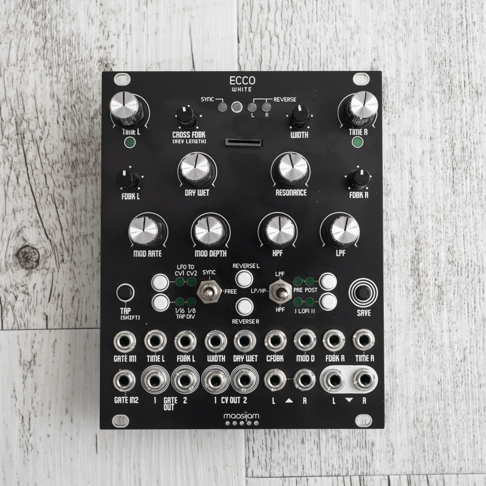
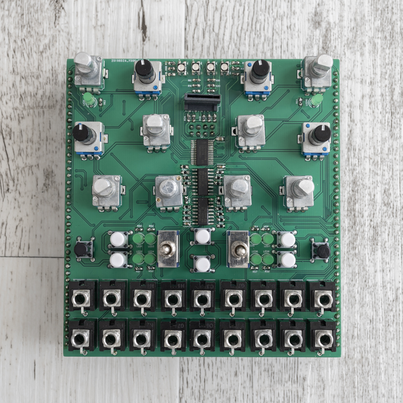

# Daisy WHITE

Examples for the daisy seed based maasijam WHITE hardware.

Features:
* 12 Pots (8 Alpha with alu knobs and 4 standard)
* 8 CV inputs 
* 2 Gate/Trig inputs
* 2 CV outs
* 2 Gate outs
* Stereo in/out
* 8 push buttons
* 2 On/Off/On switches
* 4 RGB leds (3mm, smd)
* 10 GREEN leds (3mm, th)
* Micro SD card

